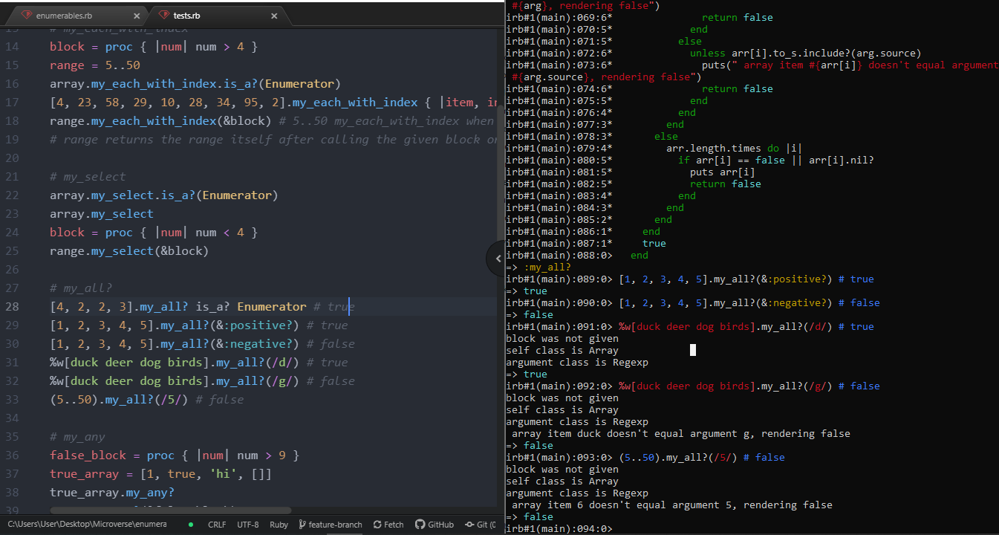

# Enumerable Methods
In this project, I have used enumerable module that gets mixed into the Array and Hash classes (among others) and provides you with lots of handy iterator methods. To prove that there's no magic to it, those methods are rebuilt in a simple way.

# :hammer: Built With
* Ruby
* Atom
* Robocop

# Screenshot

#  :bust_in_silhouette: Worked on this challenge:
## Rayan Rassam
* Github:[@Rayan84](https://github.com/Rayan84)
* Twitter:[@Rayan65096267](https://twitter.com/Rayan65096267)
* LinkedIn:[@rayan rassam](https://www.linkedin.com/in/rayan-rassam-18a0a426/)

## Credits
The original project is by Odin

## Contribution
Contributions, issues and feature requests are welcome!
Feel free to check the [Issue](https://github.com/Rayan84/Bubble_sort/issues) and help me improve!
